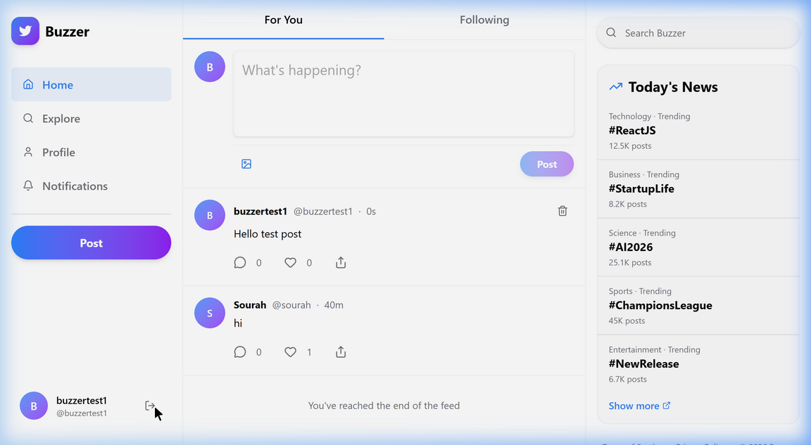

# Buzzer — Full-Stack Social Media App

A modern, full-stack social media platform built with **React**, **Vite**, **Tailwind CSS**, and **Supabase**. Buzzer features real-time posting, likes, comments, user authentication, notifications, and a sleek Twitter-inspired UI with a three-column responsive layout.

## Screenshots

### Login Page

### Home Feed

## Tech Stack

- **Frontend:** React, Vite, Tailwind CSS, Shadcn UI
- **Backend:** Supabase (Auth, Database, Storage, Realtime)
- **Icons:** Lucide React
